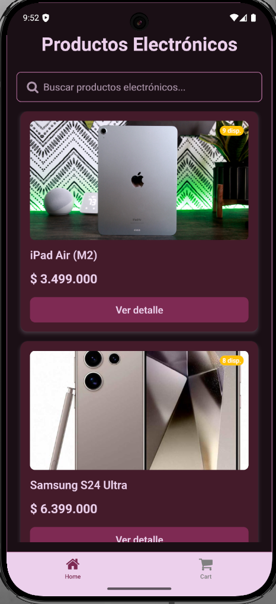
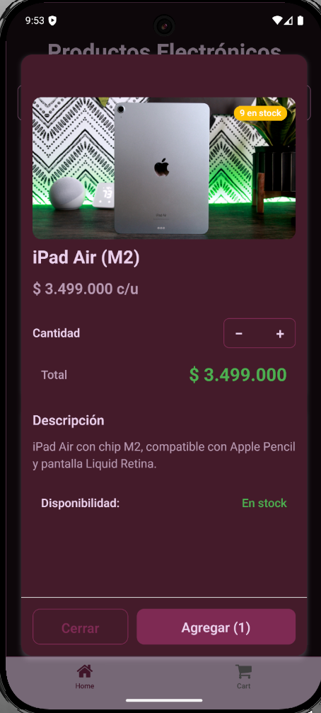
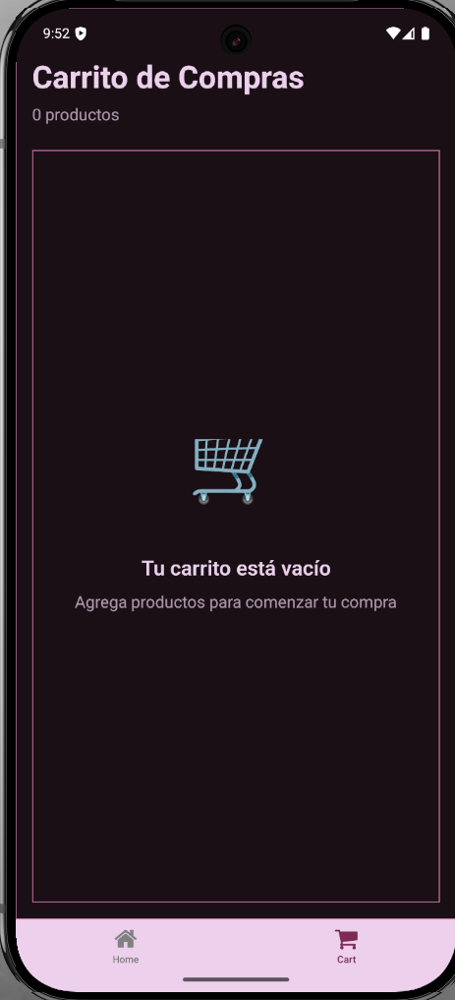
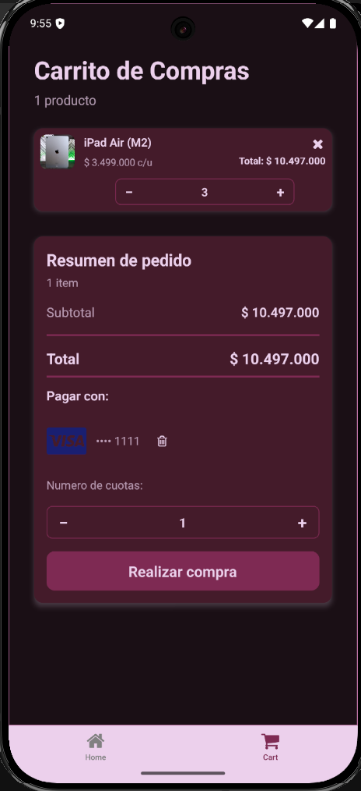
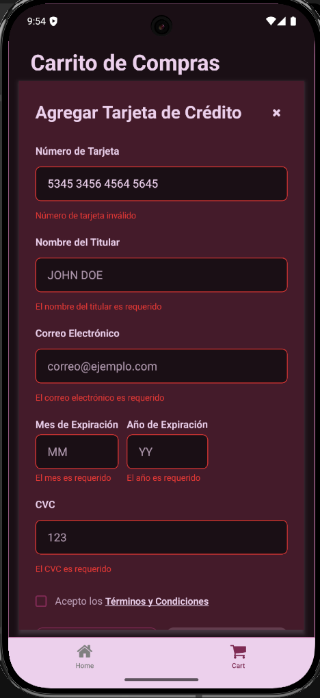
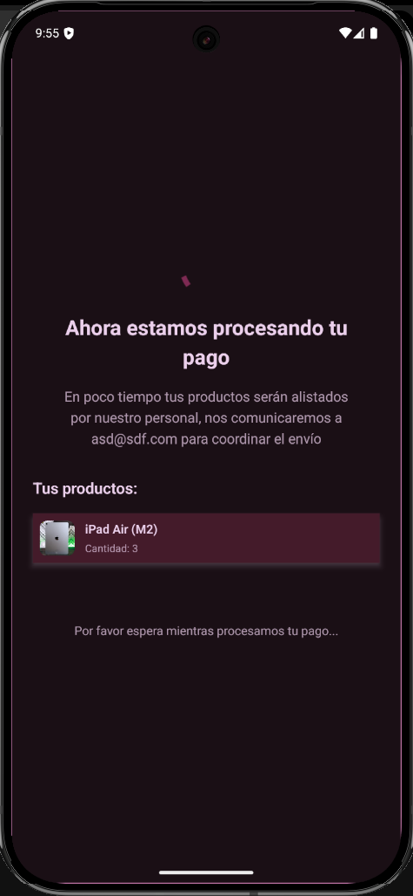
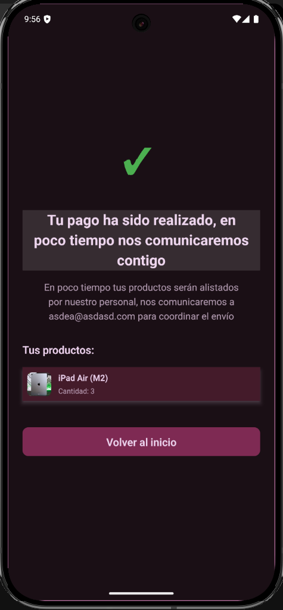
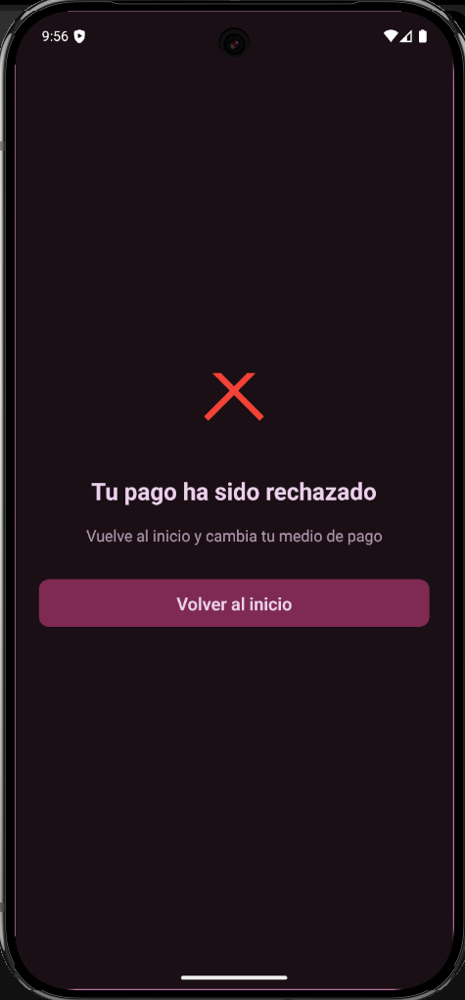

# 🛍️ Virtual Store App (React Native CLI)

A modern **mobile e-commerce app** built with **React Native CLI**, **Redux Toolkit**, and **Jest**.
It lets customers browse products, view details, add to cart, add a credit card (Visa/Mastercard), choose installments, and complete a purchase via a payment gateway.

---

## ✨ Highlights

- 🏠 Home with **product search** and quick detail access.
- 🧱 **Atomic Design** architecture (atoms → molecules → organisms → views).
- 🛒 Cart with **quantity edit**, **remove**, **per-item subtotal**, and **grand total**.
- 🔔 **Tab bar badge** when items are added to the cart.
- 💳 Add credit card with **card-validator** (Luhn check + brand detection).
- 📄 Fetch **Terms & Conditions PDF** via the **Acceptance Token** endpoint before card submission.
- 🧾 Installments selector (cuotas) integrated into checkout payload.
- ⏳ **Payment Processing** screen with live validation (approved/declined).
- 🌗 **Dark mode** that follows the user’s system preference.
- ✅ **80%+ test coverage** with Jest & React Testing Library.
- 📦 Signed **Android APK** included for reviewers.

---

## 🖼️ Screenshots

**Home**


**Product Detail Modal**


**Cart (empty)**


**Cart (with items)**


**Add Card Modal**


**Payment Processing**


**Payment Approved**


**Payment Declined**


---

## 🧠 Architecture & Tech

| Layer | Details |
|---|---|
| Framework | React Native CLI |
| State | Redux Toolkit (slices for `products`, `cart`, `transaction`) |
| Tests | Jest + React Testing Library (80%+ coverage) |
| HTTP | Axios services (`products`, `transactions`) |
| Payments | Acceptance token, card tokenization, create transaction, validate transaction |
| Validation | `card-validator` + `isCreditCard` utility |
| Design | **Atomic Design** using **only base React Native components** from atoms upward |
| Theming | Light/Dark mode via OS preference |

---

## 🧩 Core Flows

### 1) Browse & Search
- Fetch and display products on the **Home** screen.
- Search bar filters products on the fly.

### 2) Product Detail & Add to Cart
- Open **Product Detail Modal** → choose quantity with **StepperInput**.
- Live total updates (`unit price × quantity`).
- Adding items shows a **notification badge** in the **cart tab**.

### 3) Cart Management
- Change quantities, remove items, see **per-item subtotal** and **grand total**.
- Add or **change credit card**; card brand icon (Visa/Mastercard) displays after validation.
- Select **installments** before checkout.

### 4) Checkout & Payment
- On checkout, the app navigates to **Payment Processing** while validating with the payment platform.
- **Approved**: user sees success message with shipping info → cart is cleared → navigate to Home.
- **Declined**: user sees an error and can retry with a different card.

---

## 🗂 Project Structure (Atomic Design)

> The codebase follows Atomic Design and uses only React Native base components for atoms upward.
> Structure (as in the attached screenshot):

```
src
├─ components
│  ├─ atom
│  │  ├─ ActivityIndicatorAtom
│  │  ├─ BadgeAtom
│  │  ├─ ButtonAtom
│  │  ├─ CardAtom
│  │  ├─ CheckboxAtom
│  │  ├─ DividerAtom
│  │  ├─ ImageAtom
│  │  ├─ SafeAreaAtom
│  │  ├─ SkeletonAtom
│  │  ├─ SpacerAtom
│  │  ├─ StepperInputAtom
│  │  ├─ TagAtom
│  │  ├─ TextAtom
│  │  ├─ TextInputAtom
│  │  ├─ ToastAtom
│  │  ├─ ViewAtom
│  │  ├─ AtomBaseProps.d.ts
│  │  └─ index.ts
│  ├─ molecule
│  │  ├─ AddCardModalMol
│  │  ├─ CardSummaryMol
│  │  ├─ CartItemMol
│  │  ├─ ProducDetailModalMol
│  │  ├─ ProductCardMol
│  │  ├─ ProductCardSkeletonMol
│  │  └─ SearchBarMol
│  └─ organism
│     ├─ CartOrg
│     └─ ProductListOrg
├─ constants
│  └─ theme.ts
├─ hooks
│  └─ services.ts
├─ services
│  └─ services.ts
├─ stateManagement
│  ├─ reducers
│  │  ├─ cart.reducer.ts
│  │  ├─ products.reducer.ts
│  │  └─ transaction.reducer.ts
│  └─ store.ts
├─ utils
├─ views
│  ├─ Cart
│  │  ├─ Cart.test.tsx
│  │  └─ index.tsx
│  ├─ Home
│  │  ├─ Home.test.tsx
│  │  └─ index.tsx
│  └─ PaymentProcesing
│     └─ index.tsx
├─ App.tsx
└─ index.js
```

> *Note:* Folder names like `ProducDetailModalMol` and `PaymentProcesing` are shown **exactly as in the project tree**.

---

## ⚙️ Setup & Run

1. **Install dependencies**
```bash
yarn install
# or
npm install
```

2. **Environment variables**
```bash
ENVIRONMENT_URL=https://your-backend.example.com
```

3. **Run on Android**
```bash
yarn android
```

4. **Run tests**
```bash
yarn test
```

---

## 🔌 API Endpoints (expected)

- `GET /products` — fetch all products.
- `GET /transactions/aceptance` — fetch **Acceptance Token** (Terms & Conditions PDF).
- `POST /transactions/tokenize` — tokenize credit card.
- `POST /transactions` — create transaction (amount, card token, products, installments).
- `PUT /transactions/:id` — validate/update transaction status.

---

## 📱 Download

**Signed Android APK**: attach the file or link here for reviewers.

---

## 📄 License

MIT (or your preferred license).

---

If you want, I can also provide a **GitHub-friendly badges section** and a **Contributing guide**.
